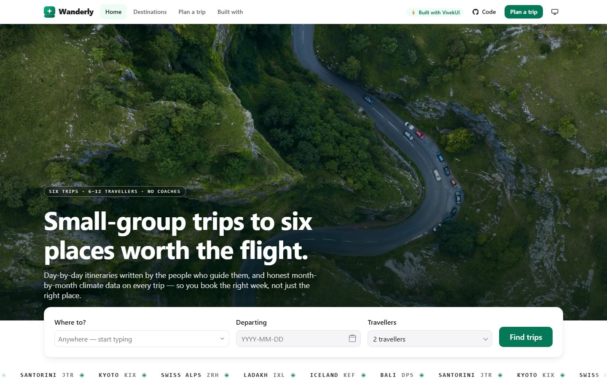
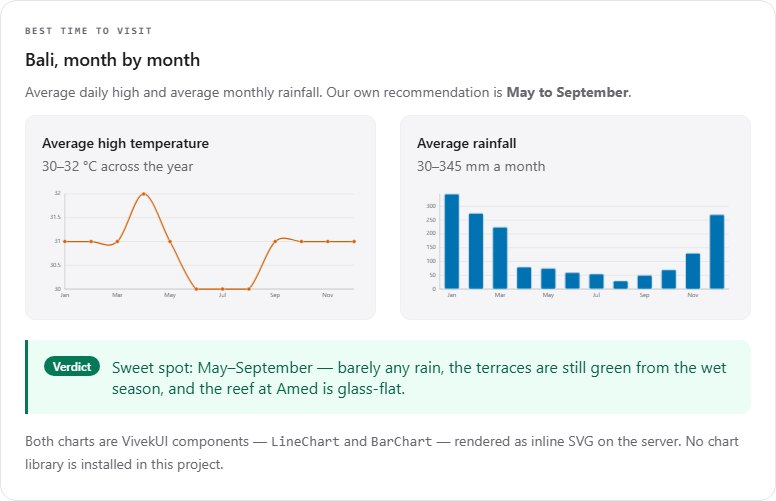

<div align="center">

# Wanderly — a free travel website template for Next.js

**Six trips. Day-by-day itinerary timelines. Real month-by-month climate charts.
No chart library, no Tailwind, no config.**

[](https://nextjs.org)
[](https://react.dev)
[](https://www.typescriptlang.org)
[](https://www.npmjs.com/package/@the_viveksingh/vivek-ui)
[](#what-is-not-in-this-project)
[](LICENSE)

### [**Live demo →**](https://wanderly.vivekkumarsingh.in) &nbsp;·&nbsp; [**Documentation →**](DOCUMENTATION.md) &nbsp;·&nbsp; [**Use this template →**](https://github.com/intellectwithvivek/wanderly/generate)

[](https://wanderly.vivekkumarsingh.in)

</div>

---

Wanderly is a complete, production-quality website for a boutique tour operator selling
six curated trips — Bali, Santorini, Kyoto, the Swiss Alps, Ladakh and Iceland. It is not
a landing page with lorem ipsum in it: every trip has a real nine-or-ten-day itinerary, an
inclusions and exclusions list, a departure calendar, and twelve months of climate data.

The whole interface is built with **[VivekUI](https://ui.vivekkumarsingh.in/docs?utm_source=vivekui-template&utm_campaign=travel&utm_medium=readme)**,
a free React component library with **zero runtime dependencies**.

## Why this exists

**To show what VivekUI can actually build.** A component library is easy to demo with a
button and a modal, and much harder to demo with a whole site — a booking flow, an
itinerary timeline, live countdowns, real charts, a filterable planner, dark mode and
structured data — without reaching for Tailwind halfway through. Wanderly is that
demonstration: every visible element is a VivekUI component, and the entire custom
stylesheet is one file.

**To save you the first two weeks.** Most tour and travel sites need the same pieces: a
catalogue, a detail page with an itinerary, a comparison table, a booking form, and enough
SEO to be found. They are built here, wired together, and verified in a browser. Clone it,
swap `data/trips.ts`, ship it.

📖 **[Read the full documentation →](DOCUMENTATION.md)** — data model, theming, the ticket
motif, SEO and AEO, deployment, and recipes.

## What makes it different

**The trip pages tell you when to go.** Every destination page carries two charts — average
daily high by month, and rainfall by month — plus a one-line verdict naming the months.
They are `LineChart` and `BarChart` from VivekUI: pure inline SVG, rendered on the server,
with a visually hidden data table for screen readers. **There is no charting dependency in
this project.**

[](https://wanderly.vivekkumarsingh.in/destinations/bali#best-time)

**One motif, used consistently.** Every trip appears as a boarding-pass ticket stub: a mono
route strip (`LIS ✈ DPS`), a perforated tear line, and a semicircle punched out of each
side. It is about forty lines of CSS in `app/globals.css` — two `radial-gradient` masks
composited together — and it is the same component on the homepage, the destinations index,
the deals carousel and the search results.

**The itinerary is the money shot.** `Timeline`, with the day number in the marker and the
night's accommodation and meals as badges under each day.

## Quick start

Requires **Node.js 20.9+** (22 LTS recommended).

```bash
git clone https://github.com/intellectwithvivek/wanderly.git
cd wanderly
npm install
npm run dev
```

Open <http://localhost:3000>. That is the whole setup — there is no config file to fill in,
no CLI to run, and no design tokens to generate.

```bash
npm run build      # production build
npm run start      # serve the build
npm run lint       # eslint
npm run typecheck  # tsc --noEmit
```

## Deploy

[](https://vercel.com/new/clone?repository-url=https%3A%2F%2Fgithub.com%2Fintellectwithvivek%2Fwanderly&project-name=wanderly&repository-name=wanderly)

Then set your own domain in one place — `SITE.url` in [`data/site.ts`](data/site.ts) — and
the canonicals, Open Graph tags, sitemap and JSON-LD all follow.

## Making it yours

| To change | Edit |
|---|---|
| The trips — copy, prices, itineraries, climate, photos | [`data/trips.ts`](data/trips.ts) |
| Site name, domain, nav, promotion links | [`data/site.ts`](data/site.ts) |
| FAQ copy (feeds the page **and** the FAQPage schema from one string) | [`data/faq.ts`](data/faq.ts) |
| Structured data | [`data/schema.ts`](data/schema.ts) |
| The accent colour and the ticket motif | [`app/globals.css`](app/globals.css) |

The accent is seven custom properties. Change these and every component follows, because
every value in VivekUI is a CSS custom property:

```css
:root {
  --vk-color-primary: #047857;        /* emerald 700 */
  --vk-color-primary-hover: #065f46;
  --vk-color-primary-subtle: #ecfdf5;
  /* … */
}
```

## What is in the box

**Routes** — `/` · `/destinations` · `/destinations/[slug]` (6 prerendered) · `/plan` ·
`/built-with` · a 404 · `sitemap.xml` · `robots.txt` · `llms.txt`

Every route is statically prerendered. The homepage revalidates hourly so the offer
countdowns stay live.

**SEO** — Metadata API per route with `metadataBase`, canonicals, Open Graph and Twitter
cards; `app/sitemap.ts` and `app/robots.ts` generated from the catalogue; exactly one `<h1>`
per page; server components by default.

**Structured data** — `TravelAgency` and `WebSite` on the homepage, `TouristTrip` with
`itinerary` and `offers` on each trip page, plus `BreadcrumbList` and `FAQPage`. Only
properties the types actually define, so it validates clean.

**AEO** — an FAQ block whose answers are the same strings as the FAQPage schema, and a
[`public/llms.txt`](public/llms.txt) with the trips, the prices and the attribution.

**Accessibility** — WCAG AA. One `h1` per page, no skipped heading levels, a skip link as
the first tab stop, visible 2px focus rings, `prefers-reduced-motion` honoured (the marquee
stops rather than slowing), every image with real alt text, and the charts backed by data
tables. Verified in a real browser: zero console errors, and no horizontal overflow at
390px or 1440px.

## What is not in this project

The dependency list is the point:

- **No** Tailwind, PostCSS plugin, or build-time CSS pipeline
- **No** Radix, CVA or clsx
- **No** Recharts, Chart.js, D3 or canvas — the charts are VivekUI
- **No** Emotion or styled-components, so no runtime style computation
- **No** icon package — the star rating and status glyphs are CSS

```
dependencies: next, react, react-dom, @the_viveksingh/vivek-ui
```

See [`/built-with`](https://wanderly.vivekkumarsingh.in/built-with) for every component used,
deep-linked to its documentation.

## Documentation

| | |
|---|---|
| [**DOCUMENTATION.md**](DOCUMENTATION.md) | The full guide — data model, theming, charts, SEO, AEO, deployment, recipes |
| [`/built-with`](https://wanderly.vivekkumarsingh.in/built-with) | Live component map: every section → the component that builds it |
| [`public/llms.txt`](public/llms.txt) | The machine-readable brief for answer engines |
| [VivekUI docs](https://ui.vivekkumarsingh.in/docs?utm_source=vivekui-template&utm_campaign=travel&utm_medium=readme) | The library itself |

## Powered by VivekUI

Built with ❤️ using VivekUI — **91 React components · 6 SVG charts · zero runtime
dependencies.** One install, one CSS import, no config.

```bash
npm i @the_viveksingh/vivek-ui
```

[Documentation](https://ui.vivekkumarsingh.in/docs?utm_source=vivekui-template&utm_campaign=travel&utm_medium=readme)
· [Components](https://ui.vivekkumarsingh.in/docs/components?utm_source=vivekui-template&utm_campaign=travel&utm_medium=readme)
· [Charts](https://ui.vivekkumarsingh.in/docs/charts?utm_source=vivekui-template&utm_campaign=travel&utm_medium=readme)
· [npm](https://www.npmjs.com/package/@the_viveksingh/vivek-ui)
· [GitHub](https://github.com/intellectwithvivek/vivek_UI)
· [Vivek Kumar Singh](https://vivekkumarsingh.in/?utm_source=vivekui-template&utm_campaign=travel&utm_medium=readme)

## Licence

[MIT](LICENSE). Use it for anything, commercial included.

The VivekUI credit in the footer is **removable** — it is one component,
[`components/site-footer.tsx`](components/site-footer.tsx). A ⭐ on
[the library](https://github.com/intellectwithvivek/vivek_UI) is appreciated instead.

Photographs are from [Unsplash](https://unsplash.com) under the Unsplash licence and are
hot-linked, not redistributed. Avatars are from [i.pravatar.cc](https://i.pravatar.cc).
Wanderly is a fictional company; the trips, prices and reviews are invented.
